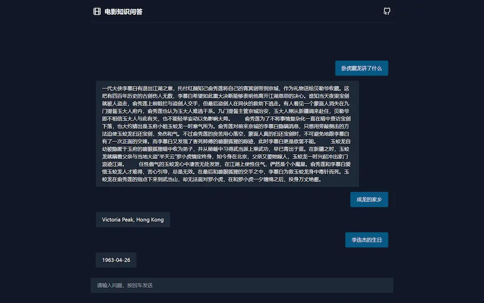

# 电影知识问答

基于知识图谱的电影知识问答系统。

[](https://kgqa.mrcai.dev)

## ✨ 项目介绍

- 训练 TF-IDF 向量算法和朴素贝叶斯分类器，预测用户文本所属的问题类别
- 使用分词库解析用户文本词性，提取关键词
- 结合关键词与问题类别，在 Neo4j 中查询问题的答案
- 通过 Flask 对外提供 RESTful API
- 前端交互与答案展示

## 🚀 项目使用

在 `backend` 目录下添加环境变量文件 `.env`。

```
# Neo4j 数据库地址
DATABASE_URI=

# Neo4j 用户名
DATABASE_USER=

# Neo4j 密码
DATABASE_PASSWORD=
```

启动后端服务。

```
cd backend
gunicorn app:app
```

在 `frontend` 目录下添加环境变量文件 `.env`。

```
# 后端服务地址
VITE_API_BASE_URL=
```

启动前端服务。

```
cd frontend
npm build
npm preview
```

## 🗃️ 技术栈

### 数据库

[](https://neo4j.com/)

### 核心 QA 模块

[](https://www.python.org/)
[](https://scikit-learn.org/stable/index.html)
[](https://github.com/fxsjy/jieba)

### 后端

[](https://www.python.org/)
[](https://www.python.org/)
[](https://render.com/)

### 前端

[](https://www.typescriptlang.org/)
[](https://preactjs.com/)
[](https://tailwindcss.com/)
[](https://pnpm.io/)
[](https://vitejs.dev/)
[](https://eslint.org/)
[](https://prettier.io/)

## 📜 许可证

[MIT](LICENSE)
